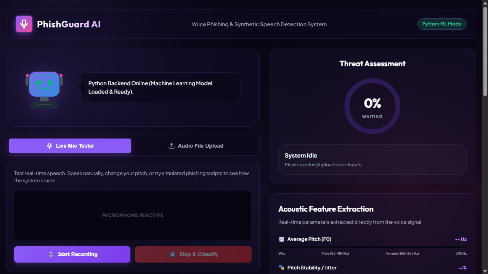
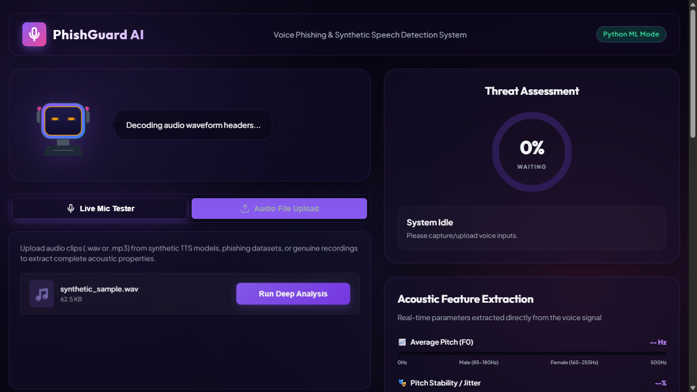
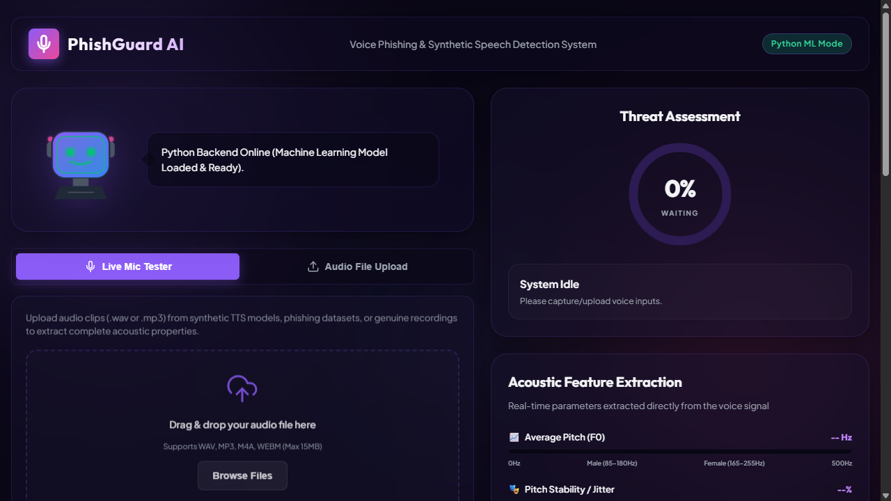

# PhishGuard‑AI

**Offline Voice‑Phishing Detection System**

A lightweight web application that:

- Accepts a short `.wav` audio file.
- Extracts 24 acoustic features (MFCCs, pitch, jitter, spectral descriptors, etc.).
- Classifies the voice as **Human** or **Synthetic (AI‑generated)** using a high‑accuracy Support Vector Machine (≈94 % accuracy).
- If the voice is human, a fast heuristic evaluates stress cues (jitter, pause‑ratio) and labels the call as **Safe**, **Medium‑Risk**, or **Very‑Risky**.

All processing runs locally – no external APIs, no internet, no API keys. The UI uses modern glass‑morphism, animated mascot feedback and a benchmark table comparing four classifiers (Logistic Regression, MLP, Random Forest, SVM). 

## Application Screenshots

| 🎙️ Homepage (Live Mic Tester) | 📁 Audio File Upload | 📊 Threat Analysis Results |
|:---:|:---:|:---:|
|  |  |  |

## Project Structure
```
PhishGuard‑AI/
│
├─ templates/          # HTML page (index.html)
├─ static/             # app.js (logic) & style.css (design)
├─ samples/            # Example audio files (genuine & synthetic)
├─ models/             # Trained SVM model, scaler, benchmark JSON
├─ data/               # Original FoR dataset (archive.zip)
├─ feature_extractor.py   # 24‑dim acoustic feature extraction (librosa)
├─ train_model.py         # Training, cross‑validation, benchmarking
├─ server.py              # Flask API ( /api/analyze , /api/benchmark )
├─ requirements.txt       # Python dependencies
└─ README.md              # (this file)
```

## Quick Start (Windows)
```powershell
# 1️⃣ Install dependencies
pip install -r requirements.txt

# 2️⃣ (Optional) Re‑train the model – only needed if you change features or data
python train_model.py

# 3️⃣ Launch the server
python server.py

# 4️⃣ Open your browser → http://localhost:5000
#    Upload a .wav file and see the result instantly.
```

## How It Works
1. **Feature Extraction** – `feature_extractor.py` converts the audio into a 24‑value vector (MFCC‑13, pitch, jitter, spectral centroid, RMS, ZCR, chroma‑4, roll‑off, bandwidth, pause‑ratio).
2. **Stage 1 (SVM)** – The vector is scaled and fed to a pre‑trained Support Vector Machine that outputs *Human* or *Synthetic*.
3. **Stage 2 (Risk Heuristic)** – For human speech, a weighted sum of jitter (60 %) and pause‑ratio (40 %) yields a *stress index* (0‑100). Thresholds map the index to **Safe**, **Medium‑Risk**, or **Very‑Risky**.
4. **Web UI** – `app.js` sends the file to `/api/analyze`, receives JSON, updates the result card, animates the mascot and records the run in the browser’s local storage.
5. **Benchmark** – `train_model.py` evaluates four classifiers; results are saved in `models/models_benchmark.json` and displayed on the site.

## Why This Project?
- **Security relevance:** voice phishing (vishing) is a growing threat.
- **End‑to‑end pipeline:** from raw audio → features → ML → UI → risk assessment.
- **Offline & privacy‑preserving:** no cloud calls, suitable for academic demos.
- **Experimental rigor:** cross‑validated benchmark of four algorithms; SVM chosen for best trade‑off of accuracy and speed.
- **Extensible:** modular code makes it easy to swap in deep‑learning models, add more features, or containerise.

## License
This project is released under the MIT License – feel free to fork, modify, and use it for research or teaching.

---
*Happy detecting!*
